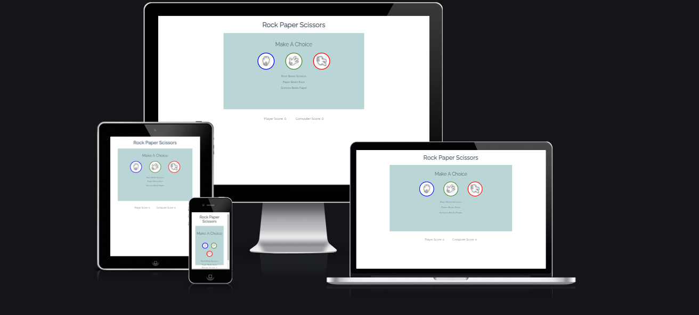
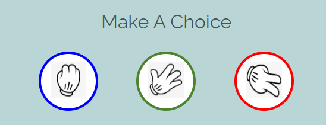
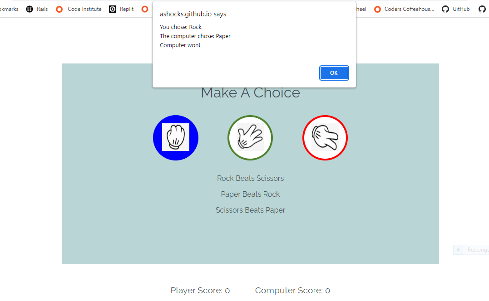
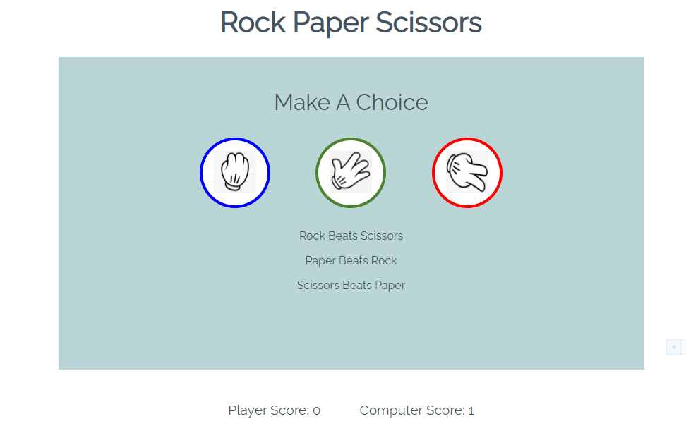

# Rock Paper Scissors

Rock Paper Scissors is a game that anyone can play and is often played by people to make a decision in a situation where there is indecision and there is agreement to settle an issue on a random result .. like tossing a coin, only more fun.
The site will be targeted towards both adults and children as a fun way to learn how to apply it's rules to help come to decisions with other people in their lives.

## Features

### Existing Features

# Header
 Featured at the top of the page, the header shows the game name Rock Paper Scissors in a font that is ## clear and easily visible to the user.
 The header clearly tells the user what game they are playing.

    

    

# The Game Options
 The game options include a clear instruction to choose a button to click.
 Each button has a different colour border, blue, green and red with a white background which changes to its border colour background when the user hovers over them.
 This section provides interactive buttons that the user can click to make their choice and play the game.

     

    

-The game results
    -When the user clicks on a button, it displays the users choice on a pop-up alert and then tells the user what the random choice of the computer is.
    -The alert then tells the user who has won and updates the scoreboard accordingly.

    
    

## Features left to implement
   
   -There is a lot that I would do to this game when there is time, such as a working scoreboard and pop-up alerts to tell the user who has won each game as well as as overall winner.
   - I think the game could be a lot simpler to design and implement but I overcomplicated it myself as I went along,  which is a lesson that I have learned for the future.

 ## Testing
    
    -I tested the game in different browsers: Chrome, Safari and Firefox.
    -I confirmed that the header, buttons, rules, options and scoreboard are all readable and easy to   understand.
    -I confirmed that the colours anf fonts chosen are easy to read and accessible by running it trough lighthouse in devtools.

    - I confirmed that the project is responsive, and looks good on all standard screen sizes using the devtools device toolbar.

## Bugs
    
    - Solved Bugs
        - when I deployed my project to Github pages, I discovered the links to the other files (CSS, JS, images etc.) wefe not workng.
        - I discovered this was because I had used absolute filepaths such as this in my code.

        <link rel="stylesheet" href="assets/css/style.css">
 
        -Removing the starting / fixed the problem.

## Validator testing

    - HTML
        - No errors were found when passing through the official WC3 validator.
    - CSS
        - No errors were found when passing through the official (Jigsaw)) validator.

## Unfixed Bugs

    - No unfixed bugs

## Deployment 

    - The site was deployed to Github pages. The steps to deploy are as follows:
        - In the Github repository, navigate to the settings tab.
        - From the source section drop-down menu, seect the master branch.
        - Once the master branch was selected, the page provided the link to the live website.

        The deployed site can be seen [here](https://ashocks.github.io/rock-paper-scissors/)

## Credits

    - Much of the code for the design part was taken from 
    [LoveMaths](https://learn.codeinstitute.net/ci_program/diplomainsoftwaredevelopmentecommerce)

 

